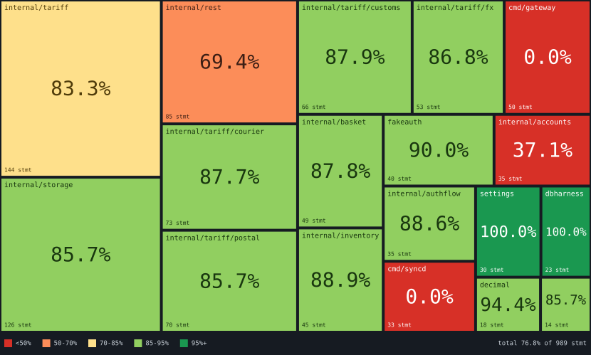

# go-covergrid

Go coverage in one PR comment, drawn as a grid map: tiles sized by statements, coloured by coverage.

It runs a coverage gate, then turns the result into a **Grid Map** — a proportionally-sized,
coverage-coloured picture of where a repository's tests are and aren't — and posts one pull request
comment carrying the gate result, the picture, and the change since the base branch.



## Read this before you enable it

The Grid Map is **published to public image hosting on every pull request run, by default.**
(A `push` run renders the picture but never uploads it, because it has no comment to put it in.)

GitHub strips inline `<svg>` from a comment body, forbids `style`, and refuses `data:` URIs, and every
image it does render is refetched through its camo proxy, which cannot reach anything requiring
authentication. An inline picture therefore requires an anonymously readable public URL. There is no
configuration of GitHub that avoids this.

So for a private repository, publishing discloses your package tree and each package's coverage to
anyone holding the URL. The URL is unguessable, not secret. It appears in the comment and in camo's
cache.

If you don't want any of it, set `publish-image: false`; the comment still carries every number, minus
the picture.

## Your grid maps expire after 72 hours

By default the picture is uploaded to [Litterbox](https://litterbox.catbox.moe), which **deletes it
after 72 hours.**

### Keeping them: `catbox-userhash`

If you want the pictures to stick around, create a [Catbox](https://catbox.moe) account, copy the
userhash from your account settings, and pass it in. Publishing then goes to Catbox instead of
Litterbox and nothing expires.

```yaml
- uses: gringolito/go-covergrid@v1
  with:
    catbox-userhash: ${{ secrets.CATBOX_USERHASH }}
```

## Isn't this go-cover-treemap?

Partly, and [nikolaydubina/go-cover-treemap](https://github.com/nikolaydubina/go-cover-treemap) got
there first. It's a CLI: feed it a coverage profile, get an SVG treemap. If that's what you want, use
it — it's good, it's had far more eyes on it, and it nests packages where this doesn't.

The difference is scope. go-cover-treemap draws a picture and hands it to you. This runs the gate,
remembers the base branch's coverage as a baseline, reports what your PR changed, and keeps one comment
updated in place. The picture is one section of that comment.

If nesting is what you're after, that's a real reason to prefer the other one — see
[ADR-0004](docs/adr/0004-grid-map-geometry.md) for why this is flat.

## Usage

A complete workflow. Save it as `.github/workflows/ci.yml` and it works as-is:

```yaml
name: CI

on:
  pull_request:
  push:
    branches: [main] # required: this is what produces the baseline

permissions:
  contents: read
  pull-requests: write # to post the comment
  actions: read # to read the baseline run's artifacts

jobs:
  test:
    runs-on: ubuntu-latest
    steps:
      - uses: actions/checkout@v5
      - uses: actions/setup-go@v6
        with:
          go-version-file: go.mod

      - run: go test ./... -coverprofile=cover.out -covermode=atomic -coverpkg=./...

      - uses: gringolito/go-covergrid@v1
        with:
          profile: cover.out
          config: ./.testcoverage.yml
```

Name the file whatever you like — the baseline lookup finds the workflow it is running in on its own.
One thing in there is easy to get wrong, though, and it fails quietly rather than loudly.

**The `push` trigger is not optional.** The baseline is the breakdown file from the most recent
successful run of this workflow *on the base branch*, so a workflow that only runs on `pull_request`
never produces one. Coverage still gates and the grid map still renders — you just never get the
comparison against `main`, on any PR, forever.

The permissions block is load bearing too, and the action cannot request any of it on your behalf.
Note that `pull_request` runs triggered from a **fork** get a read-only token no matter what you put
there, so the comment can't be posted on those; that's GitHub's rule, not this action's.

A first run on a repository has no baseline yet by definition, so the comment arrives without the diff
section. That's expected, not a misconfiguration; the second PR after a merge to `main` gets one.

### Inputs

| Input | Default | What it does |
| --- | --- | --- |
| `profile` | `cover.out` | The coverage profile from `go test -coverprofile`. Handed straight to the gate; nothing here parses it. |
| `config` | — | Path to your `.testcoverage.yml`. Without one the gate has no thresholds and always passes. |
| `github-token` | `${{ github.token }}` | Used for the baseline lookup, the artifact download and the comment. |
| `base-branch` | the repository default branch | Where the baseline comes from. |
| `breakdown-artifact` | `coverage-breakdown` | Artifact name for the breakdown file. Changing it orphans every existing baseline. |
| `diff-threshold` | `-101` | Minimum allowed change in total coverage, in percentage points. `-101` disables it. |
| `publish-image` | `true` | Publish the Grid Map. Read the disclosure above. |
| `catbox-userhash` | — | Optional. A Catbox userhash, so the images never expire. Pass it from a secret. |
| `fail-on-gate` | `true` | Fail the job when the gate fails. The comment is posted either way. |

### Outputs

`total-coverage`, `total-statements`, `covered-statements`, `package-count`, `grid-map-path`,
`grid-map-url`, `gate-outcome`.

## How to read a Grid Map

Every package is one tile. A tile's **area** is its statement count, so the big tiles are the code
you have a lot of. A tile's **colour** is its coverage band: red below 50%, orange to 70, yellow to
85, light green to 95, dark green above. Because area is statements and colour is coverage, the
coloured proportion of the picture *is* the repository's overall coverage.

## Where the numbers come from

Everything — the Grid Map, the total, the diff summary, the impacted tables — is computed from
[go-test-coverage](https://github.com/vladopajic/go-test-coverage)'s breakdown files, which the
embedded gate step writes.

## Example `.testcoverage.yml`

```yaml
profile: cover.out
threshold:
  file: 0
  package: 0
  total: 70
exclude:
  paths:
    - \.pb\.go$
    - ^cmd/
```

The gate annotates absolute-threshold violations inline on the Files changed tab, so the comment
doesn't repeat them. The one failure with no inline equivalent is a drop past `diff-threshold` —
there's no line to annotate — so the comment names that one explicitly, with numbers.

## Development

No dependencies, no build step, no `node_modules`. Tests are `node:test`:

```bash
node --test test/*.test.js
```

To look at a Grid Map without running anything on GitHub:

```bash
node src/render-gridmap.js test/fixtures/sample-breakdown.txt /tmp/grid-map.svg
```

The picture at the top of this file is rendered from the same fixture and committed, so a change to
the renderer leaves it stale. CI fails when it is, and regenerating is the same command with a
different destination:

```bash
node src/render-gridmap.js test/fixtures/sample-breakdown.txt docs/example-grid-map.svg
```

Layout regressions are invisible in unit tests and obvious in an image, so open the SVG. There are
two fixtures: `sample-breakdown.txt` (18 packages, real statement counts under invented package names)
and `big-breakdown.txt` (120 packages, fully synthetic, for watching the layout degrade). Both are
regenerated with `node test/fixtures/make-breakdown.js test/fixtures/cover.out sample-breakdown.txt`,
which stands in for
go-test-coverage. That generator is test tooling and nothing in `src/` may import it.

The renderer never touches the network. Uploading and comment posting are separate scripts, because
the upload host is unreachable from some corporate networks and the renderer has to stay testable
without it.
