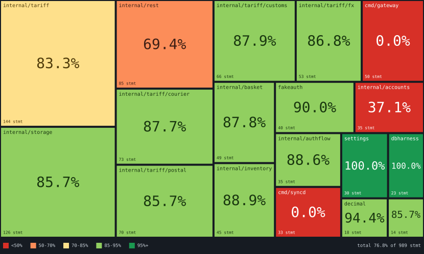

# go-covergrid

Go coverage in one PR comment, drawn as a grid map: tiles sized by statements, coloured by coverage.

The action runs a coverage gate, renders the result as a **Grid Map**, and posts one pull request
comment with the gate result, the picture, and the change since the base branch. The Grid Map shows
where the repository's tests are and aren't. Each tile's area is proportional to its statement count.



## Grid Map image: `attachment-token`

GitHub comments can't embed an SVG directly, so the action uploads the Grid Map as a GitHub attachment,
the same as dragging an image into a comment. Only people who can read the repository can see it, and
it doesn't expire.

The upload needs a personal access token. `GITHUB_TOKEN` and GitHub App tokens are rejected. Use one of:

- a **fine-grained token** scoped to the repository with `Pull requests: Read and write`
- a **classic token** with the `repo` scope

The token's owner must have write access to the repository. Store the token as a secret:

```yaml
- uses: gringolito/go-covergrid@v1
  with:
    attachment-token: ${{ secrets.COVERGRID_ATTACHMENT_TOKEN }}
```

The token is used only for the upload, which is attributed to its owner. `github-token` still posts the
comment.

Without `attachment-token`, the comment is posted without the image. Pull requests from forks get no
secrets, so they never upload. Their read-only `GITHUB_TOKEN` can't post the comment either.

## How this differs from go-cover-treemap

[nikolaydubina/go-cover-treemap](https://github.com/nikolaydubina/go-cover-treemap) came first. It is a
CLI that turns a coverage profile into an SVG treemap, and it nests packages where this action doesn't.
If you only want the picture, use it.

This action does more around the picture. It runs the gate, stores the base branch's coverage as a
baseline, reports what your PR changed, and keeps one comment updated in place. The picture is one
section of that comment.

For why the layout here is flat, see [ADR-0004](docs/adr/0004-grid-map-geometry.md).

## Usage

This workflow works as-is. Save it as `.github/workflows/ci.yml`:

```yaml
name: CI

on:
  pull_request:
  push:
    branches: [main] # required: this is what produces the baseline

permissions:
  contents: read
  pull-requests: write # to post the comment
  actions: read # to read the baseline run's artifacts

jobs:
  test:
    runs-on: ubuntu-latest
    steps:
      - uses: actions/checkout@v5
      - uses: actions/setup-go@v6
        with:
          go-version-file: go.mod

      - run: go test ./... -coverprofile=cover.out -covermode=atomic -coverpkg=./...

      - uses: gringolito/go-covergrid@v1
        with:
          profile: cover.out
          config: ./.testcoverage.yml
          attachment-token: ${{ secrets.COVERGRID_ATTACHMENT_TOKEN }}
```

The file name doesn't matter. The baseline lookup finds the workflow it runs in.

**The `push` trigger is required.** The baseline is the breakdown file from the most recent successful
run of this workflow on the base branch. A workflow that only runs on `pull_request` never produces one.
Nothing fails. The gate still runs and the Grid Map still renders, but no PR ever shows a comparison
against `main`.

The `permissions` block is required, and the action can't request permissions for you. Runs triggered
by `pull_request` from a **fork** get a read-only token regardless of this block, so the comment can't
be posted there. That is a GitHub rule.

The first run on a repository has no baseline, so its comment has no diff section. This is expected.
The second PR after a merge to `main` gets one.

### Inputs

| Input | Default | What it does |
| --- | --- | --- |
| `profile` | `cover.out` | Coverage profile from `go test -coverprofile`. Passed to the gate. The action doesn't parse it. |
| `config` | none | Path to your `.testcoverage.yml`. Without one the gate has no thresholds and always passes. |
| `github-token` | `${{ github.token }}` | Used for the baseline lookup, the artifact download, and the comment. |
| `base-branch` | the repository default branch | Where the baseline comes from. |
| `breakdown-artifact` | `coverage-breakdown` | Artifact name for the breakdown file. Changing it orphans every existing baseline. |
| `diff-threshold` | `-101` | Minimum allowed change in total coverage, in percentage points. `-101` disables it. |
| `attachment-token` | none | Personal access token for uploading the Grid Map image. See [Grid Map image](#grid-map-image-attachment-token). |
| `fail-on-gate` | `true` | Fail the job when the gate fails. The comment is posted either way. |

### Outputs

`total-coverage`, `total-statements`, `covered-statements`, `package-count`, `grid-map-path`,
`grid-map-url`, `gate-outcome`.

## Reading a Grid Map

Each package is one tile. Tile **area** is the package's statement count, so big tiles are big
packages. Tile **colour** is the coverage band: red below 50%, orange to 70%, yellow to 85%, light green
to 95%, dark green above. Area is statements and colour is coverage, so the coloured share of the
picture is the repository's overall coverage.

## Where the numbers come from

Every number is computed from the breakdown files that the embedded
[go-test-coverage](https://github.com/vladopajic/go-test-coverage) gate step writes. That covers the
Grid Map, the total, the diff summary, and the impacted tables.

## Example `.testcoverage.yml`

```yaml
profile: cover.out
threshold:
  file: 0
  package: 0
  total: 70
exclude:
  paths:
    - \.pb\.go$
    - ^cmd/
```

The gate annotates absolute-threshold violations inline on the Files changed tab, so the comment
doesn't repeat them. A drop past `diff-threshold` has no line to annotate, so the comment reports that
one with numbers.

## Development

There are no dependencies and no build step. Tests use `node:test`:

```bash
node --test test/*.test.js
```

To render a Grid Map locally:

```bash
node src/render-gridmap.js test/fixtures/sample-breakdown.txt /tmp/grid-map.svg
```

The picture at the top of this file is rendered from the same fixture and committed. A renderer change
makes it stale, and CI fails when it is. Regenerate it with the same command and a different
destination:

```bash
node src/render-gridmap.js test/fixtures/sample-breakdown.txt docs/example-grid-map.svg
```

Unit tests don't catch layout regressions, but an image does, so open the SVG after layout changes.
There are two fixtures:

- `sample-breakdown.txt` has 18 packages with real statement counts under invented names.
- `big-breakdown.txt` has 120 synthetic packages, for watching the layout degrade.

Regenerate them with the generator, which stands in for go-test-coverage:

```bash
node test/fixtures/make-breakdown.js test/fixtures/cover.out sample-breakdown.txt
node test/fixtures/make-breakdown.js test/fixtures/big.out big-breakdown.txt
```

The generator is test tooling, and nothing in `src/` may import it.

The renderer never touches the network. Upload and comment posting are separate scripts, because the
upload needs a personal token and the renderer must stay testable without one.
