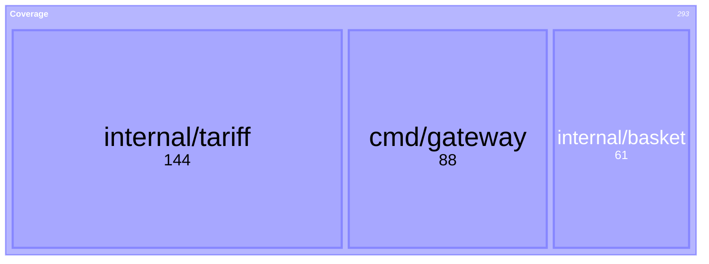
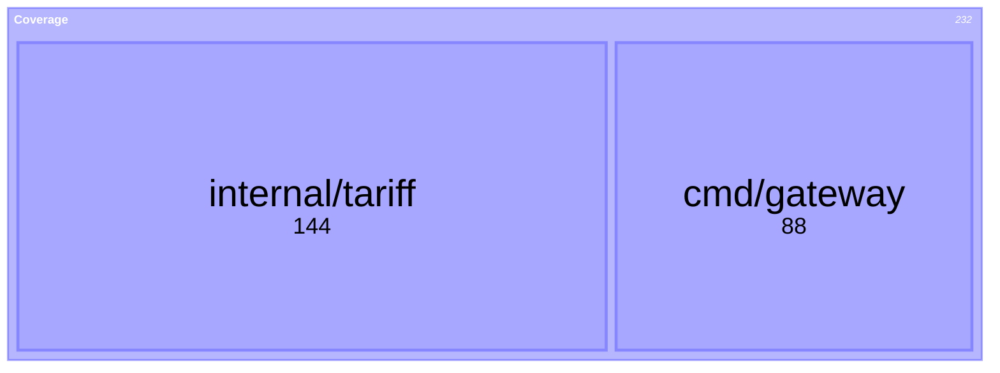
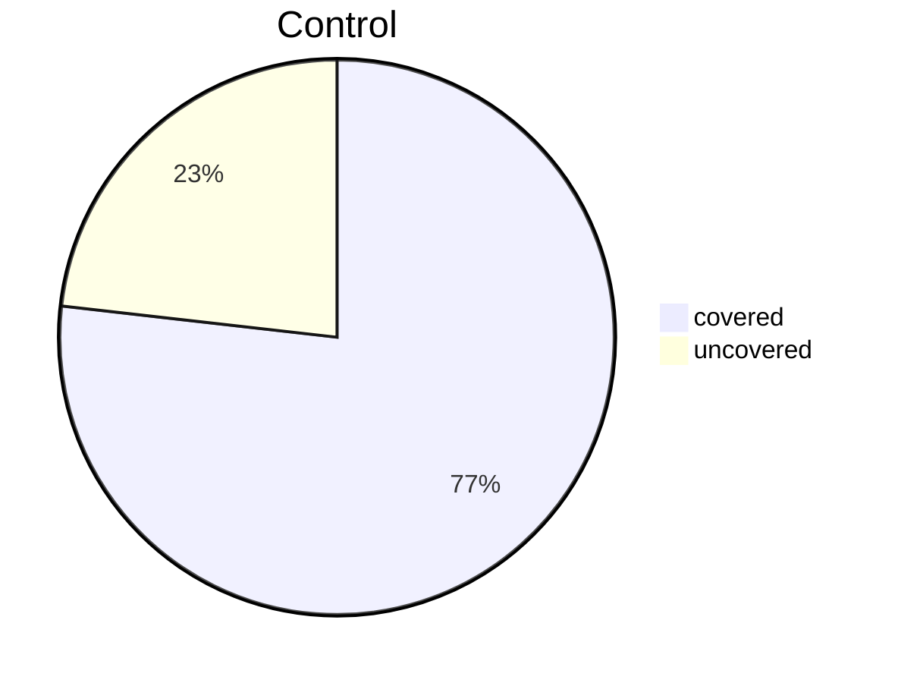

# Mermaid capability probe

Throwaway. Answers two questions GitHub does not document: which Mermaid version it
runs, and whether the beta treemap type renders here.

## Version

```mermaid
info
```

## Treemap, beta keyword



## Treemap, plain keyword



## Treemap with per-node colour


## Pie, as a control that definitely works


